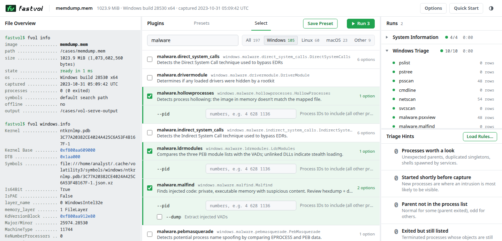
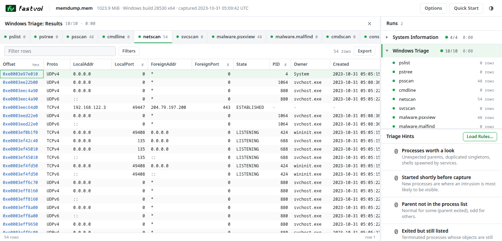

<p align="center">
  <picture>
    <source media="(prefers-color-scheme: dark)" srcset="docs/assets/logo-dark.svg">
    
  </picture>
</p>

<p align="center">
  <b>Volatility 3 memory forensics, rewritten in Rust.</b><br>
  The result of telling claude ~"/goal max speed vol3 rewrite rust 0 deps"
</p>

<p align="center">
  <a href="docs/building.md"></a>
  <a href="https://github.com/code-zm/fvol/actions/workflows/ci.yml"></a>
  <a href="https://github.com/code-zm/fvol/releases/latest"></a>
  <a href="#license"></a>
</p>

<p align="center">
  <a href="#install">Install</a> ·
  <a href="#quick-start">Quick start</a> ·
  <a href="docs/usage.md">Usage</a> ·
  <a href="docs/web-ui.md">Web UI</a> ·
  <a href="#performance">Performance</a> ·
  <a href="#documentation">Docs</a>
</p>

<p align="center">
  <picture>
    <source media="(prefers-color-scheme: dark)" srcset="docs/assets/benchmark-dark.svg">
    
  </picture>
</p>

## Highlights

- **All 197 plugins** of volatility3 2.28.2, with the same options, `--help`, errors and exit codes.
- **356-473x faster than python** and 12-29x faster than vol-rs on a first triage session ([how measured](#performance)).
- **Zero dependencies**: one static binary, Rust standard library only.
- **Every common format**: raw, LiME, ELF core, crash dump, VMware, QEMU, AVML, Xen, gzip/bzip2/xz.
- **Built-in web UI**: `fvol serve`.
- Tab autocomplete commands

## Install

Requires Rust 1.95+. Linux on x86-64 and arm64.

```bash
cargo build --release    # -> target/release/fvol
```

> [!NOTE]
> The build targets the build machine's CPU; for a portable binary see
> [docs/building.md](docs/building.md#build-for-other-machines).

## Quick start

```bash
eval "$(fvol completion bash)"                           # TAB-complete plugins and options
fvol -f memory.raw windows.pslist.PsList                 # run a plugin
fvol -h                                                  # list plugins
fvol -s ./symbols -f linux.lime linux.pslist.PsList      # Linux/macOS: symbol dir
fvol -f memory.raw -o out/ windows.dlllist.DllList --dump # dump files
fvol -f memory.raw -r json windows.pslist.PsList         # quick, pretty, csv, json, jsonl
fvol --version                                           # version banner
```

Windows symbols are downloaded automatically. See [docs/usage.md](docs/usage.md).

## Web UI

```bash
fvol serve -f memory.raw   # prints a local URL with an access token
```

<p align="center">
  <picture>
    <source media="(prefers-color-scheme: dark)" srcset="docs/assets/screenshots/web-ui-workspace-dark.png">
    
  </picture>
</p>

<p align="center">
  <picture>
    <source media="(prefers-color-scheme: dark)" srcset="docs/assets/screenshots/web-ui-results-dark.png">
    
  </picture>
</p>

Pick plugins or a preset, run them together, and read the results a tab per plugin: million-row
tables, one filter across all plugins, process trees, exports, every `fvol` option and your own
triage rules. Everything is saved in `~/.fvol` and comes back when the dump is reopened.
Localhost only, token-protected. [docs/web-ui.md](docs/web-ui.md)

## Supported images

| OS      | Arch     | Tested versions                                                             |
| ------- | -------- | --------------------------------------------------------------------------- |
| Windows | x64, x86 | XP, 2003, Vista, 2008, 7, 2012 R2, 10 (17763, 19041), 11 (22000, 26100)     |
| Linux   | x64, x86 | kernels 3.2, 4.15, 5.15, 6.1, 6.8, 6.17, 7.0                                |
| macOS   | x64      | 10.9, 10.12                                                                 |

Formats: raw, LiME, ELF core, Windows crash dump, VMware, QEMU savevm, AVML, Xen; gzip/bzip2/xz
compressed; `http(s)://` URLs; Windows page files.

## Verification

Every plugin's stdout, exit code and dumped files are diffed against python volatility3 2.28.2:

| Check                                     | Result                     |
| ----------------------------------------- | -------------------------- |
| No-argument runs, 31 images               | 1,975 / 1,975 identical    |
| Options x renderers sweep, 15 images      | ~4,000 cases, all match ³  |
| Dumped files, 31 images                   | 315 / 315 identical        |
| Fuzzing with corrupted images             | 17,000+ runs, 0 panics     |
| Unit tests                                | 600 passing                |

³ Except the documented gaps in [differences.md](docs/differences.md). How to run the gates: [docs/development.md](docs/development.md).

## Performance

Measured on a desktop: Intel Core i7-12700KF (12 cores, 20 threads), 64 GB RAM, NVMe SSD, Linux
7.1.8. Medians of repeated runs, every run a separate process. Method, all numbers and raw data:
[bench/local/BENCHMARKS.md](bench/local/BENCHMARKS.md).

**Triage session**: the common plugins run one after another on an image the tool has not seen
(its cache empty at the start; python's symbol caches warm).

|                                              | python | vol-rs |  fastvol | vs python | vs vol-rs |
| -------------------------------------------- | -----: | -----: | -------: | --------: | --------: |
| Windows 11, 12 plugins, image in memory | 59.5 s | 3.71 s | **126 ms** | 473x | 29.5x |
| Windows 11, 12 plugins, image read from disk | 69.9 s | 6.47 s | **1.67 s** | 41.9x | 3.88x |
| Linux 6.8, 10 plugins, image in memory | 80.8 s | 2.76 s | **227 ms** | 356x | 12.1x |
| Linux 6.8, 10 plugins, image read from disk | 84.9 s | 3.59 s | **399 ms** | 213x | 9.01x |

**Every plugin once**: per-plugin speedup, geometric mean (a sum would be dominated by the few
slowest plugins).

|            | plugins | vs python, no fastvol cache | vs python, symbol caches warm | vs vol-rs (cold / warm) | output = python | vol-rs output = python |
| ---------- | ------: | --------------------------: | ----------------------------: | ----------------------: | --------------: | ---------------------: |
| Windows 11 | 77 | 108x | 556x | 14.0x / 26.9x | 76/77 ² | 59/77 |
| Linux 6.8 | 59 | 184x | 3,094x ¹ | 16.5x / 37.6x | 59/59 | 45/59 |

`windows.pslist` from start to exit: python 537 ms, vol-rs 270 ms cold / 49.8 ms warm, fastvol
21.7 ms cold / 1.3 ms warm.

¹ python decompresses and parses the kernel's 61 MB JSON symbol file on every Linux run; fastvol
keeps a binary symbol table in its cache. The no-cache column is the conservative comparison.<br>
² `windows.windows`: python iterates a set, so its row order changes from run to run; fastvol's
output equals python's after sorting ([details](docs/differences.md)).

Why it's fast: memory-mapped images and symbol tables, all-core scanning, lazy loading,
content-keyed caches that can't change output, and from-scratch libraries that beat the C
originals. [docs/architecture.md](docs/architecture.md#performance-techniques)

## Documentation

| Doc                                            | Content                                     |
| ---------------------------------------------- | ------------------------------------------- |
| [usage.md](docs/usage.md)                      | Symbols, dumping, renderers, filters, YARA  |
| [web-ui.md](docs/web-ui.md)                    | `fvol serve` and its security model         |
| [building.md](docs/building.md)                | Build profiles, portable binaries           |
| [caching.md](docs/caching.md)                  | Cache files, `--clear-cache`, env variables |
| [differences.md](docs/differences.md)          | Known differences from python volatility3   |
| [architecture.md](docs/architecture.md)        | Internals and performance techniques        |
| [development.md](docs/development.md)          | Porting plugins, parity gates, benchmarks   |

## License

Volatility Software License 1.0, as a port of Volatility 3 ([LICENSE.txt](LICENSE.txt)).

fastvol is built on the work of the Volatility Foundation and the volatility3 contributors. It is
an independent project, not affiliated with or endorsed by the Volatility Foundation.
